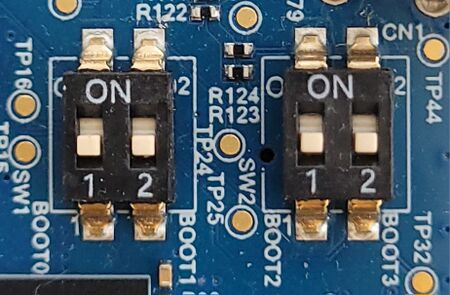
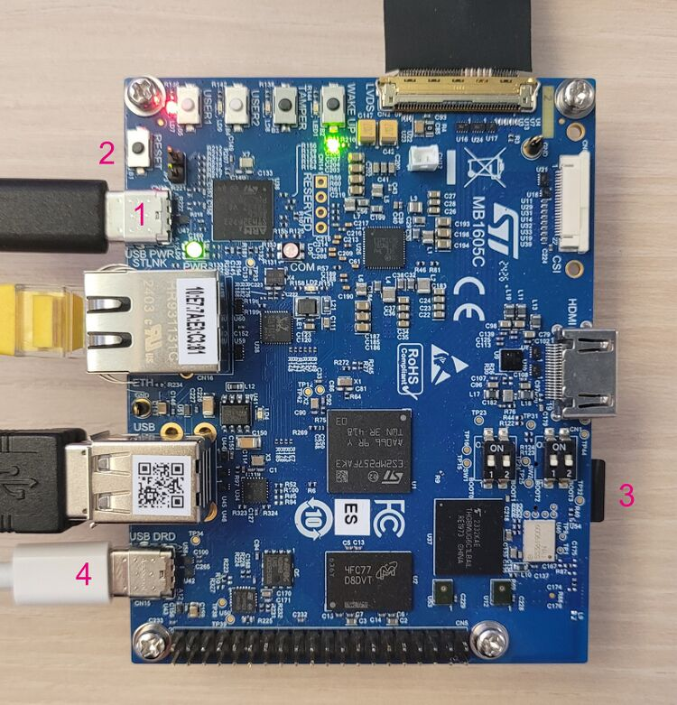
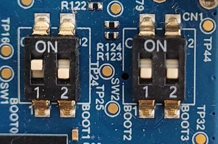

# Yocto Image for SMT32MP257f-DK Dicovery Kit

This is a custom Yocto image for [stm32mp257f-dk](https://www.st.com/en/evaluation-tools/stm32mp257f-dk.html) intended to provide vanila Yocto build flow.

This work was inspierd by [bootlin's Yocto Project and OpenEmbedded development training][_bootlin_yocto_training_].

- [Yocto Image for SMT32MP257f-DK Dicovery Kit](#yocto-image-for-smt32mp257f-dk-dicovery-kit)
	- [Getting Started](#getting-started)
	- [Flashing Target via STM32 Cube Programmer CLI](#flashing-target-via-stm32-cube-programmer-cli)
	- [Flashing Target via dd tool](#flashing-target-via-dd-tool)
	- [Booting the Board](#booting-the-board)
	- [Connecting to the Target](#connecting-to-the-target)

## Getting Started

Clone the repository:

```bash
git clone <repo-url>
```

Install dependencies:

```bash
make install_dependencies
```

Update git submodules:

```bash
make git_submodules_update
```

It is recommended to use docker container. Check out the [readme](./docker/README.md)

Build with make:

```bash
make
```

**NOTE:** You may refer to [Makefile][_makefile_] to find out, what else build types are possible.

## Flashing Target via STM32 Cube Programmer CLI

This section rely on [6.2 Image Flashing][_6_2_image_flashing_].

- Set the boot switches to the off position (boot from UART/USB):
  
- Connect the USB type-C (OTG) port (4) to the host PC that contains the downloaded image:
  
- Insert the delivered microSD card into the dedicated slot (3).
- Connect the USB type-C (power supply) port (1) to the power connector or a host PC.
- Press the reset button (2) to reset the board.
- Invoke `make flash_stm32_programmer` for flashing.

## Flashing Target via dd tool

The full description of flashing can be found under [STM32MP25 Discovery kits - Starter Package][_starter_package_].

This section rely on [6.3 Image Flashing via raw Image][_6_3_image_flashing_raw_].

Insert the sd-card into your host PC and run following command:

```bash
make flash MICROSD_CARD=/dev/mmcblk0p1
```

**ATTENTION:** BE CAREFUL! `MICROSD_CARD=/dev/mmcblk0p1` shall be the SD-CARD mounted!

## Booting the Board

This section rely on [7 Booting][_7_booting_].

- Set switches to  boot from microSD card mode:



- Check that the microSD card is inserted into the dedicated slot (3).
- Check USB-C ST-LINK (1) connection is established betwee the board and the host system:
    
- Check USB-C power supply (**!!!no data!!!**) is connected to port (4).
- Press reset button (2).
- Continue with [Connecting to the Target](#connecting-to-the-target) section.

**NOTE:** The first boot after flash will try to configure the board, which may take up to 5 minutes!

## Connecting to the Target

Add user to `dialout` group to get access to serial ports without root rights:

```bash
sudo adduser $USER dialout
```

Check `dialout` is in user's groups list:

```bash
groups
```

If the user does not have `dialout` group listed - you may re-login.

Connect to device:

```bash
picocom -b 115200 /dev/ttyACM0
```

You may use `minicom` with same command line arguments.


[_bootlin_yocto_training_]: https://bootlin.com/training/yocto/
[_makefile_]: ./Makefile
[_starter_package_]: https://wiki.st.com/stm32mpu/wiki/STM32MP25_Discovery_kits_-_Starter_Package
[_6_3_image_flashing_raw_]: https://wiki.st.com/stm32mpu/wiki/STM32MP25_Discovery_kits_-_Starter_Package#Image_flashing_via_raw_image
[_6_2_image_flashing_]:https://wiki.st.com/stm32mpu/wiki/STM32MP25_Discovery_kits_-_Starter_Package#Image_flashing
[_7_booting_]: https://wiki.st.com/stm32mpu/wiki/STM32MP25_Discovery_kits_-_Starter_Package#Booting_the_board